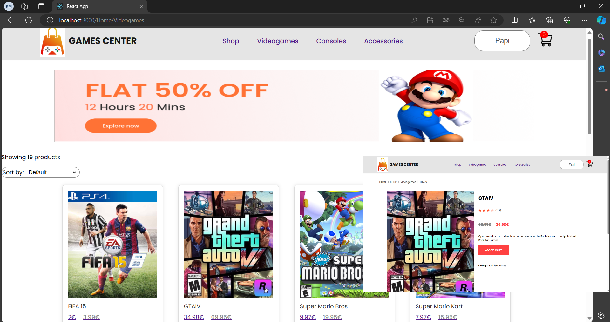

# 
Shop center

## Introduction
ShopCenter is an e-commerce platform specializing in the sale of video games, consoles, and accessories. Developed primarily with React, CSS, HTML, and Material UI for the frontend, and Node.js, Express, TypeORM and PostgreSQL for the backend. It has a login and registration system before accessing the page, a cart system to add or delete products and a payment gateway to make purchases from stripe.

## Setup
- Clone this repository -> `git clone https://github.com/NeburRLM/ShopCenter.git`
- Go into the repository -> `cd shopping-cart`

## Basic dependencies necessary for its operation
- node
- npm

> Backend
- `npm install typeorm pg` -> TypeORM: For PostgreSQL database management and schema definition.
- `npm install express` -> To handle the server and HTTP routes.
- `npm install bcrypt` ->  For password hashing.
- `npm install jsonwebtoken` -> For JWT token generation and verification.
- `npm install cookie-parser` -> For handling cookies.
- `npm install stripe` -> For payment gateway integration.
- `npm install uuid` -> For generating unique identifiers.

> Frontend
- `npm install @emotion/react @emotion/styled` -> Core functionality and styled components API for Emotion.
- `npm install @mui/material @mui/styles` -> Popular React UI framework based on Google's Material Design.
- `npm install @testing-library/jest-dom @testing-library/react @testing-library/user-event` -> Set of utilities for testing React components.
- `npm install react react-dom` -> Provide the core React library and the ReactDOM for rendering React components into the DOM.
- `npm install react-player` -> Component for playing various media types, including audio and video.
- `npm install react-router-dom` -> Library for declarative routing in React applications, allowing navigation and routing in single-page applications. 

---

## Before run project:
- `psql -U postgres`
- `CREATE DATABASE sce;`
- `typeorm migration:generate postgresql/migrations/CreateDatabase -d postgresql/data-source.js --o`
- Fix migration header format -> "export class CreateDatabase1715637681114"
- `typeorm migration:run -d postgresql/data-source.js`

## Run project
- Backend: Execute the postman query and `node index.js` 
- Frontend: `npm start`
